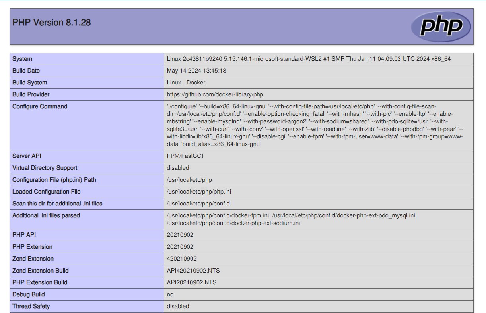

# Dockerized Modern PHP Stack

## Includes 

- PHP 8x
- MySQL
- Composer
- Nginx
- PhpMyAdmin

With demo CRUD operations and installation steps.

## Installation

To get started with, install Docker first, Install Docker Desktop (for Windows & Mac) or directly from the CLI (Linux) scripts.

Then run `docker-compose up --build -d`

All services and images with be pulled and build step by step. and you will be able to get your php project from `http://localhost` and PhpMyAdmin client running at `http://localhost:81` address. Use username `root` and password given in the `docker-compose.yml` file for the `mysql` service root password.

